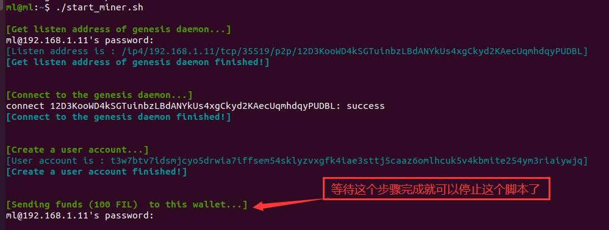
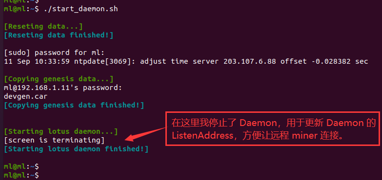
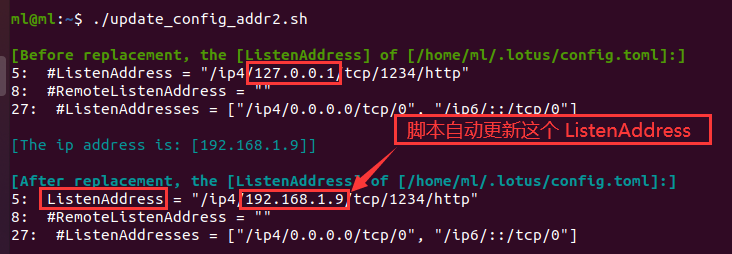
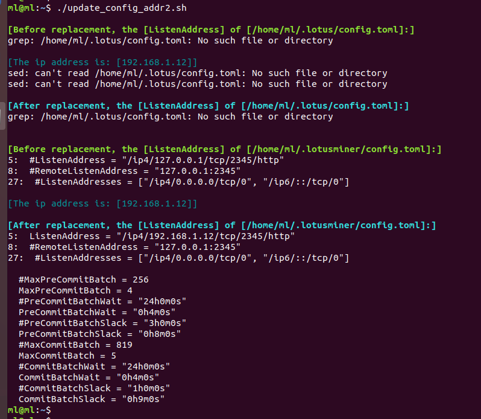
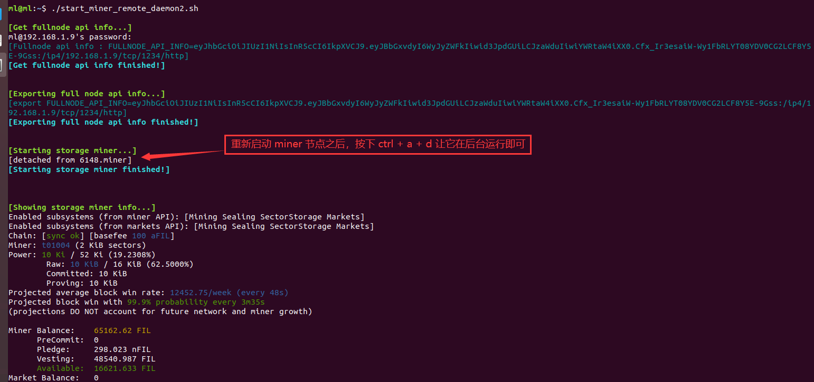
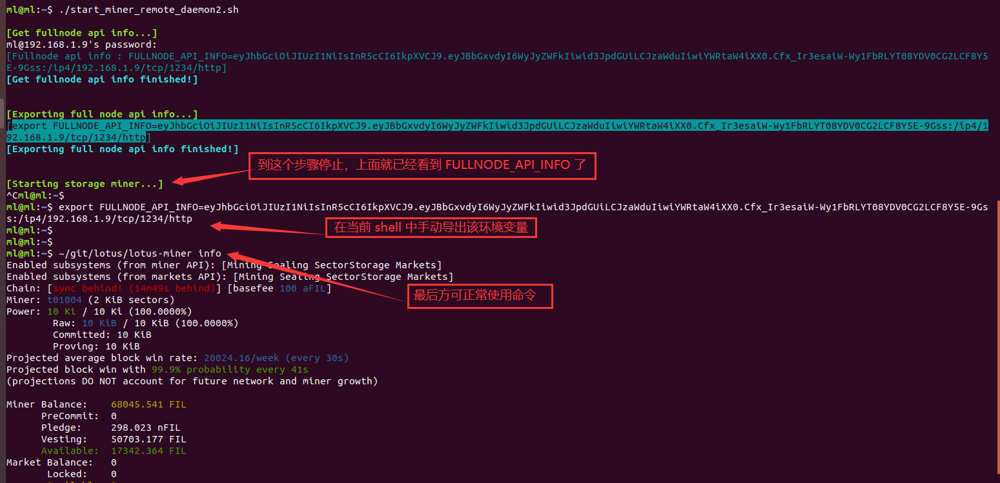

# 修改 daemon 节点

假设 `miner` 节点所使用的 `daemon` 节点不在同一台机器上，并且 `daemon` 节点不止一个（有一个备用的 `daemon` 节点），本教程将告诉你如何切换 `miner` 的 `daemon` 节点。


## 1. 实验环境介绍

本教程所使用的实验环境包括 4 台 `Ubuntu` 虚拟机，如下所示：

- 1. 创世节点和创世旷工机器： `ml@192.168.1.11`，取一个别名叫做 `GenM` （表示 `Genesis Machine` 的意思），可执行文件所在路径：`/home/ml/git/lotus/`，机器信息：`Ubuntu 20.04 @ 8G 内存`
- 2. 主 `daemon` 机器：`ml@192.168.1.9`，取一个别名叫做 `DaeMA` （表示 `Daemon Machine A`），可执行文件所在路径：`/home/ml/git/lotus/`，机器信息：`Ubuntu 20.04 @ 8G 内存`
- 3. 副 `daemon` 机器：`ml@192.168.1.10`，取一个别名叫做 `DaeMB` （表示 `Daemon Machine B`），可执行文件所在路径：`/home/ml/git2/lotus/`，机器信息：`Ubuntu 20.04 @ 8G 内存`
- 4. `miner` 机器： `ml@192.168.1.12`，取一个别名叫做 `MinM` （表示 `Miner Machine`），可执行文件所在路径：`/home/ml/git/lotus/`，机器信息：`Ubuntu 18.04 @ 8G 内存`
- 5. `lotus` 源代码版本： `lotus version 1.11.2-dev+debug+git.6812c293b`

## 2. 启动创世节点和创世旷工

启动创世节点和创世旷工的方法可参考 [【本地 2K 测试网使用教程】](../local_2k_dev_tutorial/local_2k_dev_tutorial.md)，在本教程中，直接使用脚本在 `GenM` 机器上启动。

- 创世节点启动脚本参考 [【start_genesis_daemon.sh】](./scripts/start_genesis_daemon.sh)，重启脚本 [【start_genesis_daemon2.sh】](./scripts/start_genesis_daemon2.sh)
- 创世旷工启动脚本参考 [【start_genesis_miner.sh】](./scripts/start_genesis_miner.sh)，重启脚本 [【start_genesis_miner2.sh】](./scripts/start_genesis_miner2.sh)

**注意：**

(1). 本教程中的所有脚本均放在用户的 `home` 目录（也就是 `/home/ml/` 目录），并且执行的所有命令也是在用户的 `home` 目录下执行。
(2). 脚本中使用的是 `screen` 这个软件，方便放在后台运行程序，`Ubuntu` 上安装 `screen` 的方法是：

```sh
sudo apt install screen
```

为了方便查看 `screen` 中的输出信息，需要在安装好 `screen` 之后，在 `screen` 的配置文件 `/etc/screenrc` 最后添加下面一行：

```sh
logfile /tmp/screenlog_%t.log 
```

设置好之后，使用 `screen` 启动的每一个窗口都会在 `/tmp/` 目录下生成一个以 `screenlog_` 开头的日志文件。`screen` 软件常用的两个命令：

- `ctrl + a + d`：从 `screen` 软件中分离（`Dettach`），让 `screen` 启动的程序在后台运行，注意用法：按住 `ctrl` 键之后 **不松开**，然后 **依次** 按下键盘上的 `a` 和 `d` 按键
- `screen -r xxx`：重新进入 `screen` 中运行的软件窗口（`Attach`），命令中的 `xxx` 是窗口的名称
- `screen -ls`：查看 `screen` 中正在运行的软件。


## 3. 启动主 Daemon（DaeMA）

启动 `主 Daemon`（`DaeMA`）的方法就是启动一个普通的 `Daemon`，参考 [【本地 2K 测试网使用教程】](../local_2k_dev_tutorial/local_2k_dev_tutorial.md)，在本教程中，直接使用脚本在 `DaeMA` 机器上启动。

- `主 Daemon` 节点启动脚本参考 [【start_daemon.sh】](./scripts/start_daemon.sh)，重启脚本 [【start_daemon2.sh】](./scripts/start_daemon2.sh)

启动 `主 Daemon` 节点之后，需要让 `主 Daemon` 连接创世节点，生成一个钱包，并从创世节点中获取一些初始 `FIL` 放入自己的钱包中，这几个步骤可以通过运行脚本 [【start_miner.sh】](./scripts/start_miner.sh) 的前面四步来完成，如下图所示：



`主 Daemon` 节点获得初始 `FIL` 之后，就可以停止了，目的是为了更新它的 `ListenAddress`，方便远程 `miner` 能够连接到它，如下图所示：



更新 `主 Daemon` 节点的 `ListenAddress`，可以直接通过 `vi ~/.lotus/config.toml` 来更新，把原来的 `127.0.0.1` 地址更新为 `主 Daemon` 节点的 `IP` 地址，在这里直接使用脚本 [【update_config_addr.sh】](./scripts/update_config_addr.sh) 来自动更新这个地址（注意：这个脚本中默认主机的 `IP` 地址是以 `192.168.1` 开头，如果不是，请自行修改）。



更新了 `主 Daemon` 节点的 `ListenAddress` 地址之后，需要再次重启 `主 Daemon` 节点，重启脚本使用  [【start_daemon2.sh】](./scripts/start_daemon2.sh)（注意：这个重启脚本启动之后，需要按下 `ctrl+a+d` 命令分离 `daemon` 让它在后台自动运行，以便让脚本继续执行后续剩下的命令，连接上创世节点）。


## 4. 启动副 Daemon（DaeMB）

启动 `副 Daemon`（`DaeMB`） 节点的的方法和启动 `主 Daemon` 节点的方法基本一致，唯一不同的地方就是使用脚本 [【start_miner.sh】](./scripts/start_miner.sh) 连接创世节点的时候，只需要执行它的前两步就行了，不需要创建钱包地址，以及发送 `FIL` 到 `副 Daemon` 节点中，如下图所示：


## 5. 启动 miner 旷工

启动 `miner` 旷工是在机器 `MinM` 中执行，并且 `miner` 旷工在本地是没有 `Deamon` 进程的，它使用的是远程 `DaeMA` 机器的 `Deamon`，在本教程中，启动方式是使用脚本启动，有关的命令都在脚本中，参考脚本如下：

- `miner` 旷工启动脚本 [【start_miner_remote_daemon.sh】](./scripts/start_miner_remote_daemon.sh)，重启脚本 [【start_miner_remote_daemon2.sh】](./scripts/start_miner_remote_daemon2.sh)

运行启动脚本 [【start_miner_remote_daemon.sh】](./scripts/start_miner_remote_daemon.sh) 之后，它会自动获取远程 `DaeMA` 机器的 `Deamon` 进程的 `FULLNODE_API_INFO`，并在本机中导出和使用，如下图所示：


**注意：** 该脚本在开始执行前会自动执行 **清理操作（一系列的 rm 命令）**，如果不需要，请注释它。

启动完成之后，我们一般会先按 `ctrl+c` 停止它，更新它的配置文件，然后再重启它，更新配置文件的脚本参考 [【update_config_addr2.sh】](./scripts/update_config_addr2.sh) ，该脚本的功能如下：

- 更新 `~/.lotus/config.toml` 文件中的 `ListenAddress` 为本机自己的 `IP` 地址，如果有的话
- 更新 `~/.lotusminer/config.toml` 文件中的 `ListenAddress` 为本机自己的 `IP` 地址，方便远程 `worker` 连接
- 更新 `~/.lotusminer/config.toml` 文件中的 `MaxPreCommitBatch` 为 `4`，达到 4 个扇区就开始提交
- 更新 `~/.lotusminer/config.toml` 文件中的 `PreCommitBatchWait` 为 `0h4m0s`，
- 更新 `~/.lotusminer/config.toml` 文件中的 `PreCommitBatchSlack` 为 `0h8m0s`
- 更新 `~/.lotusminer/config.toml` 文件中的 `MaxCommitBatch` 为 `5`
- 更新 `~/.lotusminer/config.toml` 文件中的 `CommitBatchWait` 为 `0h4m0s`
- 更新 `~/.lotusminer/config.toml` 文件中的 `CommitBatchSlack` 为 `0h9m0s`

更新结果如下图所示：



更新完成之后，重新启动 `miner` 节点，如下图所示：



把 `miner` 节点放到后台执行之后，如果想要重新打开看一下，可以使用 `screen -r miner` 命令，如下图所示：


**注意：** 由于我们的 `miner` 旷工使用的是远程的 `Daemon` 进程，因此，在执行任何命令之前，请确保正确的 `FULLNODE_API_INFO` 存在于你的当前 `shell` 的环境变量中，如果你不确定，可以在 `miner` 机器上先导出 `FULLNODE_API_INFO`，否则，你执行任何命令都将会看到如下所示的错误信息：


手动导出 `FULLNODE_API_INFO` 可以使用脚本 [【start_miner_remote_daemon2.sh】](./scripts/start_miner_remote_daemon2.sh) 的前半部分功能，如下图所示：




## 6. 一键切换远程 Daemon

在此之前，我们的 `miner` 使用的是远程 `DaeMA` 机器上的 `Daemon` 进程，现在如果我的 `DaeMA` 机器上的 `Daemon` 进程崩溃了，或者由于各种原因出现了问题，需要维护，此时，我们就可以先把 `miner` 旷工的远程 `Daemon` 进程切换到 `DaeMB` 机器上的 `Daemon` 进程。在本教程中，切换方法也是使用脚本实现，参考脚本是 [【change_daemon.sh】](./scripts/change_daemon.sh)，运行该脚本之前，需要先停掉 `miner` 旷工，然后再运行，运行效果如下图所示：


该脚本在修改完远程 `Daemon` 进程之后会自动启动 `miner` 旷工。


## 7. 其它

本文来自于微信群 `Filecoin技术交流-1/2/3/4/5/6/7群` 群主（`TEARS`）出品，详细信息请查看 [【Filecoin 中国社区论坛】](https://github.com/filecoin-project/community-china)。

如有任何问题，请在微信群 `Filecoin技术交流-1/2/3/4/5/6/7群` 或 `Filecoin 中国社区论坛的【讨论模块】`中讨论。

