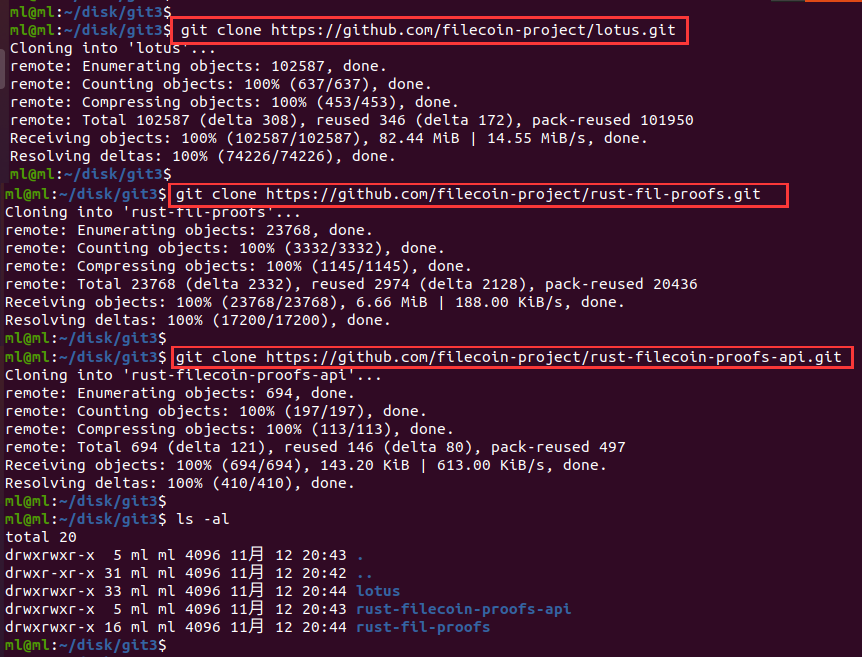
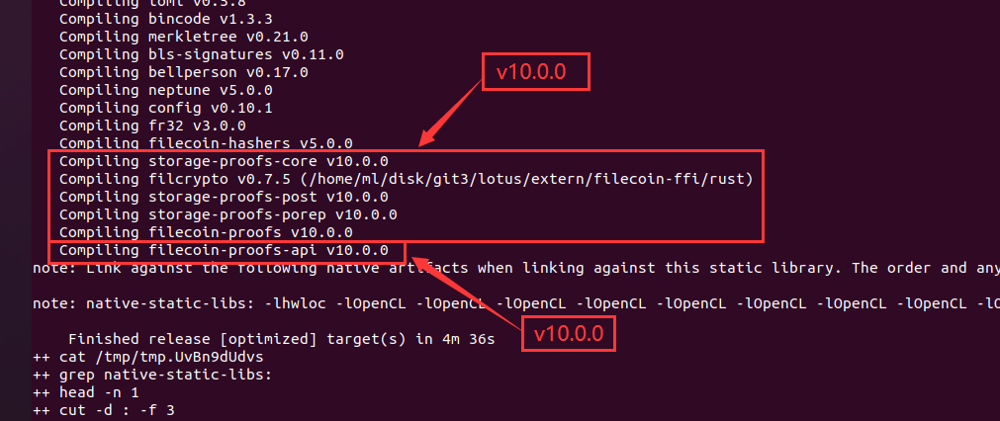
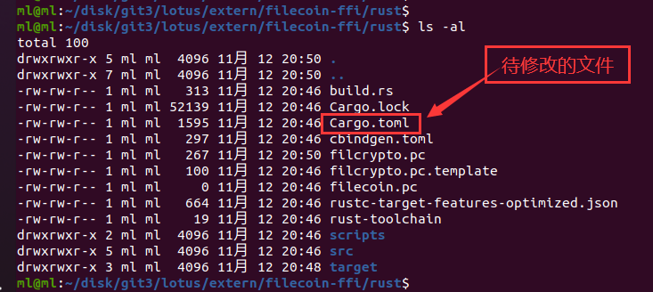
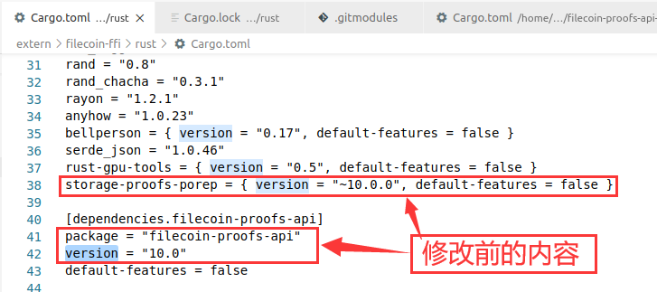
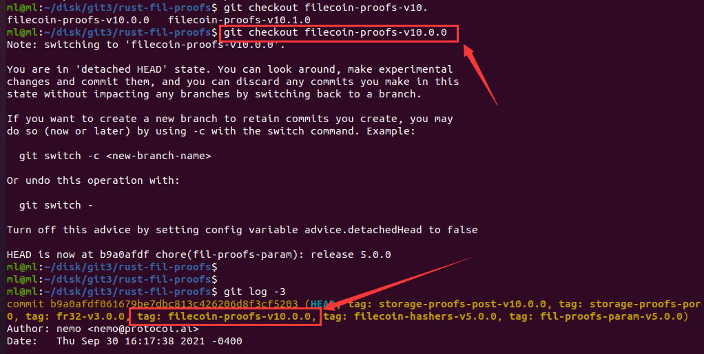
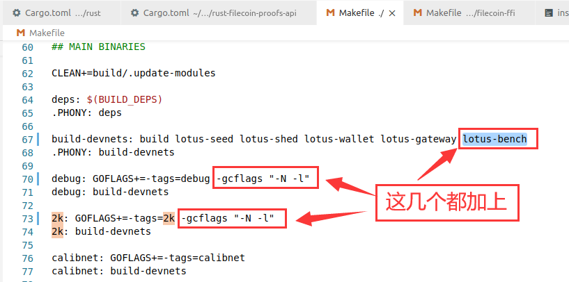
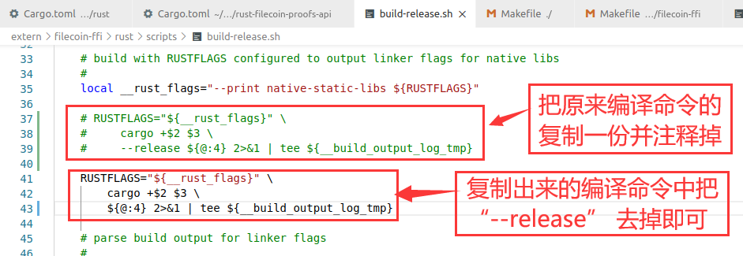
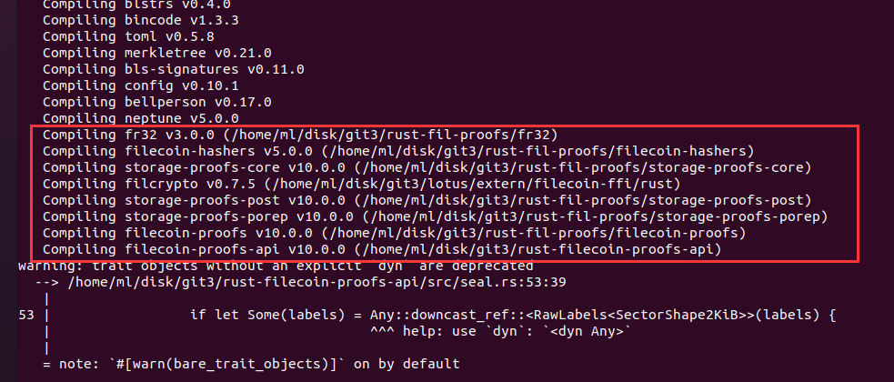
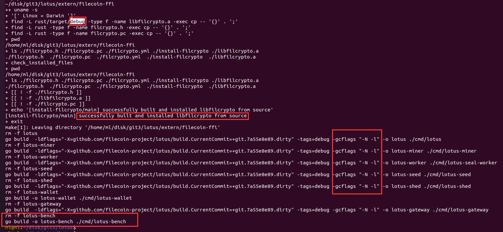
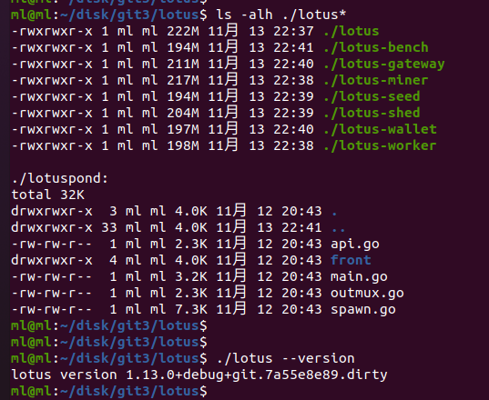

# GDB 调试 lotus 源码教程

## 1. 环境配置

### (1). 下载源代码

这里所说的源代码不仅包括 lotus 的源代码： [lotus](https://github.com/filecoin-project/lotus)，还包括底层 rust 库实现的代码： [rust-fil-proofs](https://github.com/filecoin-project/rust-fil-proofs)，以及中间一层封装接口调用的代码： [rust-filecoin-proofs-api](https://github.com/filecoin-project/rust-filecoin-proofs-api)，这里的三份代码的关系是这样的：`lotus` 调用 `rust-filecoin-proofs-api` 的 `api` 接口，而  `rust-filecoin-proofs-api` 是对底层 `rust-fil-proofs` 的一个简单封装，所以我们需要把这三个项目的代码都下载下来。

假设我们现在所在目录是 `/home/ml/disk/git3/lotus`，然后在该目录中把所有代码都下载下来：

```sh
cd /home/ml/disk/git3/lotus/
git clone https://github.com/filecoin-project/lotus.git
git clone https://github.com/filecoin-project/rust-fil-proofs.git
git clone https://github.com/filecoin-project/rust-filecoin-proofs-api.git
```

下载之后就可以看到这三个项目的代码了：



这三个库的代码都放在同一个地方，是为了方便我们在接下来修改配置文件的时候可以直接使用相对路径，而使用相对路径的好处就是：在什么机器上都可以正确找对对应的依赖库的位置，如果使用绝对路径的话，因为在每个人的机器上，这个路径一般都不同，因此，修改这个配置文件的内容都会不一样，而如果是使用相对路径，则就不会有这个问题。

#### A. 代码版本说明

本教程所使用的代码版本信息如下所示：

- **lotus** ： `lotus version 1.13.0+git.7a55e8e89`
- **lotus 分支**： `tag: v1.13.0`
- **rust-filecoin-proofs-api** ： `master:ddb562e22def`
- **rust-fil-proofs** ： `master:e55ae0b2e1185`
- **修改时间** ：`2021/11/12`

代码版本不是很重要，不同的代码版本都是可以调试的，只是下断点的时候需要注意一下，其它没有什么需要特别注意的。


### (2). 配置源代码

下载好源代码之后， `~/git/` 目录中就有这三个项目的代码，而 `lotus` 本身默认使用的底层代码库不是我们放在 `~/git/` 目录下的代码，为了让它使用我们 `~/git/` 目录下底层库的代码（方便后续修改代码和重新编译），我们需要对这项目中的配置文件做一些修改（改它们的 **Cargo.toml** 配置文件）。

**注意：**
待修改配置文件的项目有两个：`lotus` 和  `rust-filecoin-proofs-api` ，而 `rust-fil-proofs` **无需修改配置文件**，此外， 在修改 `rust-filecoin-proofs-api` 和 `rust-fil-proofs` 项目之前，需要先把它们的代码版本切换到对应的版本号，详细信息见下文。

#### A. 修改 lotus 中的配置文件

首先修改 `lotus` 目录中的 **Cargo.toml** 配置文件，让它直接使用本地的 `rust-filecoin-proofs-api` 代码。这个配置文件的路径在：`./lotus/extern/filecoin-ffi/rust/` 目录下，但是由于第一次使用这份代码，这个目录还不存在，因此，可以先编译一遍这个 `lotus` 的源码，让它先生成这个对应的目录，以及其中的相关代码，编译命令如下（**FFI_BUILD_FROM_SOURCE=1** 这个环境变量是必须的，表示自己编译底层的 Rust 库，而不是使用官方预编译好的底层 Rust 库）：

```sh
FFI_BUILD_FROM_SOURCE=1 make clean debug
```

这里的预编译，不但为了获取 `./lotus/extern/filecoin-ffi/` 目录下的源码，还需要获取 `rust-filecoin-proofs-api` 和 `rust-fil-proofs` 的具体版本号，因为我们还需要把这两个库切换到对应的版本号，才能使得代码能够正确的编译，如下图所示：



**注意：**
预编译完成之后，可以看到 `rust-filecoin-proofs-api` 的版本是 `v10.0.0` ，而 `rust-fil-proofs` 的版本是 `v10.0.0`，因此，我们还需要把这两个库的代码切换到对应的版本。

修改 `./lotus/extern/filecoin-ffi/rust/` 目录下对应的 **Cargo.toml** 文件：



**修改前：**



**修改后：**


```sh
# 两个关键的修改路径如下所示
storage-proofs-porep = { path = "../../../../rust-fil-proofs/storage-proofs-porep", version = "10.0.0", default-features = false }
path = "../../../../rust-filecoin-proofs-api"
```

注意，上述修改中，原来用 `package` 关键字的，现在用的是 `path` 关键字，并把内容改为：`path = "../../../../rust-filecoin-proofs-api"`，表示这个库存在本地指定的位置；同时由于这里直接引用了 `storage-proofs-porep` 这个库，因此，也需要把它的路径改成本地的路径。


#### B. 修改 rust-filecoin-proofs-api 库

`rust-filecoin-proofs-api` 中也需要修改对应的 **Cargo.toml** 文件，让它使用本地的 `rust-filecoin-proofs` 库中的代码，但是，在修改配置文件之前，需要把这个库的代码切换到 `v10.0.0` 版本，如下图所示：


切换命令为：

```sh
git checkout v10.0.0
```

然后再修改这个库的 **Cargo.toml** 配置文件：


**修改前：**


**修改后：**


```sh
# 三个关键的修改路径如下所示
filecoin-proofs-v1 = { path = "../rust-fil-proofs/filecoin-proofs", package = "filecoin-proofs", version = "10.0", default-features = false }
storage-proofs-core = { path = "../rust-fil-proofs/storage-proofs-core", version = "10.0", default-features = false }
storage-proofs-porep = { path = "../rust-fil-proofs/storage-proofs-porep", version = "10.0", default-features = false }
```

修改的方法也很简单，只要添加 `path = "../rust-fil-proofs/filecoin-proofs"` 到 `filecoin-proofs-v1` 这个依赖项中即可。


#### C. 修改 rust-fil-proofs 库

`rust-fil-proofs` 中不需要修改 **Cargo.toml** 文件，但是需要把它的版本切换到 `v10.0.0`，因为目前版本的 `lotus` 依赖的 `rust-fil-proofs` 库的版本就是 `v10.0.0`，如下所示：



切换命令为：

```sh
git checkout filecoin-proofs-v10.0.0
```

此时，所有的修改操作都完成了。


## 2. 编译前的准备

### (1). 编译 Debug 版本代码

经过第一节的修改配置之后，其实已经可以正常编译了，并且使用的是本地的 rust 库代码，可以自己修改 rust 库代码，然后实现一些优化、定制等工作。

但是，我们现在的目的不但是为了能够方便的修改并使用本地的代码，有时候还需要进行运行时的观察、进行动态调试等，这在程序开发过程中是不可或缺的一步。因此，我们把这个 rust 库和 lotus 都编译成带符号的可执行文件，也就是 Debug 版本，然后就方便我们动态调试和单步调试。

要把底层的 rust 库和上层的 go 实现的代码编译成 Debug 版本，需要修改以下三个配置文件：

- `~/git/lotus/Makefile`
- `~/git/lotus/extern/filecoin-ffi/install-filcrypto`
- `~/git/lotus/extern/filecoin-ffi/rust/scripts/build-release.sh`

#### A. 修改 Makefile 文件

Makefile 中要把 `lotus-bench` 模块加入到 `Debug` 组和 `2k` 组，这样的话，我们执行 `FFI_BUILD_FROM_SOURCE=1 make clean debug` 或者 `FFI_BUILD_FROM_SOURCE=1 make clean 2k` 命令的时候就能够把 `lotus-bench` 程序的 `Debug` 版本也编译出来（默认 `lotus-bench` 程序没有 `Debug` 版本的）；同时，还需要把 `-gcflags "-N -l"` 加到 `GOFLAGS`，使得调试 go 层面的代码的时候更方便，修改结果如下：



这样我们就可以编译出 Debug 版本的 `lotus-bench` 程序，方便调试。

#### B. 修改 install-filcrypto 文件

这个 `./extern/filecoin-ffi/install-filcrypto` 文件是用来安装底层 rust 库的时候用到的，因此，也需要修改它，让它指向 Debug 版本中的内容，使用 Debug 版本中的底层库来构建上层的 lotus，修改部分如下：


#### C. 修改 build-release.sh 文件

这个文件就涉及到编译底层 rust 库时使用到的编译变量（比如 `CFLAG`、 `CXXFLAG`、 `LDFLAG` 等），主要是把该文件中的 `--release` 字段去掉，这样编译出来的底层 rust 库就是 Debug 版本的（默认是编译 Debug 版本的），就带有源代码的符号信息，就可以使用 **GDB** 来跟着源代码单步调试，修改内容如下：



好了，通过以上三个文件的修改，现在已经可以编译出一个 Debug 版本的 lotus 和底层 rust 库了，最后就差一个改进版的 **GDB** 了。

### (2). 配置 GDB

Linux 中原生的 **GDB** 其实是比较难用的，我们一般都会对它做一些增强，使得我们用起来更加顺手，增强的方式一般是给 **GDB** 添加对应的插件，我们常用的插件包括 [**GEF**](https://github.com/hugsy/gef)、[**Peda**](https://github.com/longld/peda) 等，在这篇文章中，我们使用 **GEF**，当然，你要用啥由你自己决定。

本文中，我对 **GEF** 做了一些改进，使得我们用起来体验感更好，我自己修改过的 **GEF** 在 [【这里】](./files/.gdbinit-gef.py)，使用的方式是把这个文件下载到你的 `home` 目录下，然后在 `home` 目录下执行以下命令使 **GEF** 插件生效（注意这里插件是以 `.` 开头的）：

```sh
echo source "~/.gdbinit-gef.py" >> ~/.gdbinit
```

## 3. 编译并单步调试

其实有了上面的步骤，已经可以任意的调试 lotus 了，这一节我们主要关注如何下断点，如何使用 **GDB** 调试上层的 go 代码和底层的 rust 代码。

### (1). 编译 lotus

编译 lotus 很简单，就是一条命令，当然你也可以加上一些参数啥的，比如加上启用 GPU 的参数（`FIL_PROOFS_USE_GPU_COLUMN_BUILDER=1`）之类的，**当然，使用源码编译参数是必须要加上的**（`FFI_BUILD_FROM_SOURCE=1`），否则，编译 lotus 的时候，它就会从网上下载预编译好的底层库文件（**libfilcrypto.a**）。所以，一般用来生成可调试代码的编译命令如下：

```sh
FFI_BUILD_FROM_SOURCE=1 make clean debug
```

编译过程中，你就可以看到它使用的是本地 rust 库中的代码，如下图所示：





编译好之后，你就可以发现，这些文件的大小是相对比较大的，因为它们包含了大量的调试符号信息，可以方便的让我们使用 **GDB** 调试（但是运行性能会相对较低，要跑 **32GB** 扇区的话，**可能会超级慢**），如下图所示：



### (2). 调试 lotus

编译好之后，我们就开始可以调试了，在这里主要演示的是调试 `lotus-bench` 程序，并在 go 语言和 rust 语言里面下断点，观察中间结果，单步调试程序运行过程。

#### A. 启动程序并设置参数

首先使用 **GDB** 启动 `lotus-bench` 程序，命令很简单，在 lotus 目录中执行：

```sh
gdb ./lotus-bench
```

然后给 `lotus-bench` 程序加上参数，使用如下命令（就是让 `lotus-bench` 跑 **2KiB** 的扇区）：

```sh
set args sealing --sector-size=2KiB
```

这样就相当于是执行：

```sh
./lotus-bench sealing --sector-size=2KiB
```

当然，你可以在启动 `lotus-bench` 程序之前启动 rust 的日志（要在同一个终端中启用）：

```sh
export RUST_LOG=Trace
```

总之，启动并配置好参数之后的效果如下所示：


#### B. 在合适的地方下断点

上述命令只是把程序加载到内存，配置好运行参数信息，程序还没有开始运行，在它运行之前，我们需要给它下几个断点，在我们需要的地方让它停下来，方便我们观察中间结果。

现在，我们在 go 层面给它下一个断点，让它断在执行 `SealPreCommit1()` 函数的地方，这样我们就可以看到准备执行 **Pre-Commit1** 的时候传给这个函数的参数信息。**Pre-Commit1** 所在的位置是 `/home/ml/git/lotus/cmd/lotus-bench/main.go` 文件中的第 **552** 行，如下图所示：


因此，我们使用如下命令给它在这一行下一个断点：

```sh
b /home/ml/git/lotus/cmd/lotus-bench/main.go:552
```

上述命令下断点的方式只是其中的一种方式，就是指定某个文件的某一行，`b` 表示 `break` 的意思，就是下断点，如下图所示：


在 **go** 语言层面已经下了一个断点了，当然，你想在什么地方下断点都行，下几个也随你，**GDB** 每遇到一个断点就会停下来。接下来我们要在 **rust** 底层库中也下一个断点，下断点的方式和第一个断点一样，我们把断点下载到 **rust** 语言执行 **PreCommit1** 操作的地方，也就是在 `seal_pre_commit_phase1()` 函数处，这个函数所在的位置是：`/home/ml/git/rust-fil-proofs/filecoin-proofs/src/api/seal.rs` 的第 **44** 行，如下图所示：


我们要在这个函数的第一行下一个断点，执行如下命令给它下一个断点：

```sh
b /home/ml/git/rust-fil-proofs/filecoin-proofs/src/api/seal.rs:59
```

如下图所示：


但是，由于这个 `seal_pre_commit_phase1()` 函数有些小复杂，为了方便小白们迅速找到 **PreCommit1** 真正核心的代码，也就是生成 **11** 层 **layers** 的地方，我们在另一个地方也下一个断点，那就是 `/home/ml/git/rust-fil-proofs/storage-proofs/porep/src/stacked/vanilla/proof.rs` 文件中的 `generate_labels_for_encoding()` 函数，现在这个版本的代码，有两种方式实现 **PreCommit1**，一种是多线程的方式，另一种是单线程的方式，多线程方式的会更快一些，单线程方式代码简洁些，我们就以单线程方式为例，而 `generate_labels_for_encoding()` 函数就是一个选择函数，用于选择多线程实现还是单线程实现，如下所示：


我们进入到 `create_label::single::create_labels_for_encoding` 函数，这个函数内部有一个双层嵌套的 `for` 循环，外层 `for` 循环执行 **11** 次，每次生成一层 **layer**， 内层 `for` 循环执行 **1G** 次（这里说 **1G** 次是针对 **32GB** 扇区的情况，并且所说的 **1G** 次就是： `1024 * 1024 * 1024` 次）。代码如下所示：


当然，这个说生成 **11** 层数据是指对与 **32GB** 扇区的情况，对于 **2KiB** 扇区的话，是不会有这么多层的，然后我们在这个 `create_labels_for_encoding()` 函数的开头给它下一个断点，就下在 **29** 行吧，命令如下所示：

```sh
b /home/ml/git/rust-fil-proofs/storage-proofs/porep/src/stacked/vanilla/create_label/single.rs:29
```

断点现在都下好了，下一步就开始可以运行了。

#### C. 开始运行

直接输入 `r` （就是 `run` 的意思）就开始运行 `lotus-bench` 程序了，然后程序就会在 **go** 语言的 `SealPreCommit1()` 函数的地方停下来，如下图所示：


此时，就可以使用 `p` 命令查看各种变量的信息了，例如，如果我们想要看传入到 `SealPreCommit1()` 函数的 `sid`、 `ticket` 和 `piece` 变量，就可以使用如下命令查看：

```sh
p sid
p ticket
p piece
```

如下图所示：


然后再按下 `n` 键（也就是 `next` 的意思），让它继续执行下一条语句，理论上应该是 `if err != nil {` 这个语句，但是由于我们在这个函数的内部下有断点，因此，它会在有断点的地方停下来，而我们的断点是下在底层的 rust 库中，因此，断点自然就会断在底层的 rust 库中，如下图所示：


然后你想怎么调试就可以怎么调试了，当然，如果你对这个 go 语言如何调用 rust 语言感兴趣的话，也可以在上层 go 代码中断下来的时候使用命令 `n` 和 `s` 一步一步的跟着代码走，这样你就能找到 go 语言是如何调用 rust 语言的了（在这里我可以告诉你，这中间经历了很多层的调用）。刚才提到的命令 `n` 和 `s` 的区别是：

- `n` 命令：单步执行，每次执行一条语句，当遇到函数调用的时候，不会进去函数内部执行
- `s` 命令：和 `n` 命令基本一样，不同地方是：当遇到函数调用的时候，会进入函数内部执行

在此，我就不一步一步演示了，我直接执行 `c` 命令（`continue` 的意思），让它直接执行到下一个断点（如果没有下一个断点的话，就执行到程序结束），也就是我们说的最耗时的地方 ---- 真正生成 **layer** 的地方，如下图所示：


现在，你已经可以调试任意地方的任意代码了，当然，在这里生成 **layer** 的每一个细节，你也可以跟进去看一下，也可以打印中间变量，相对还是比较方便的。

至此，这份教程也就结束了，如果你还能这么认真的看到这里，那么，恭喜你，你赢了。


## 4. 其它

本文来自于微信群 `Filecoin技术交流-1/2/3/4群` 群主（`TEARS`）出品，详细信息请查看 [【Filecoin 资源分享目录】](https://github.com/CoinSummer/filecoin)。

如有任何问题，请在微信群 `Filecoin技术交流-1/2/3/4群` 中讨论。

